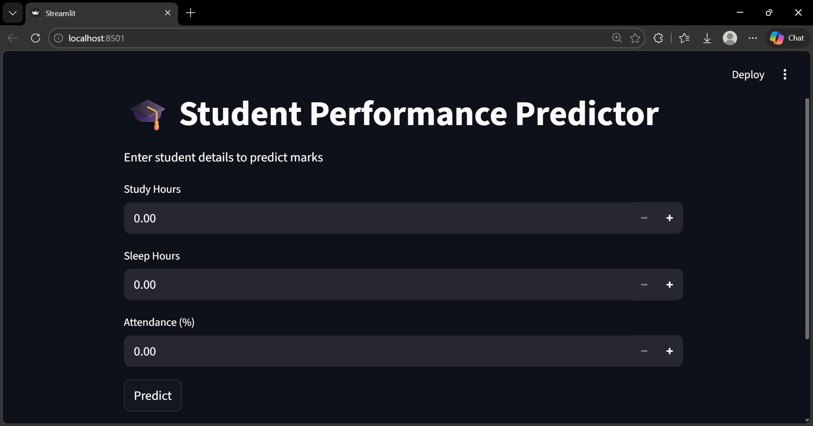
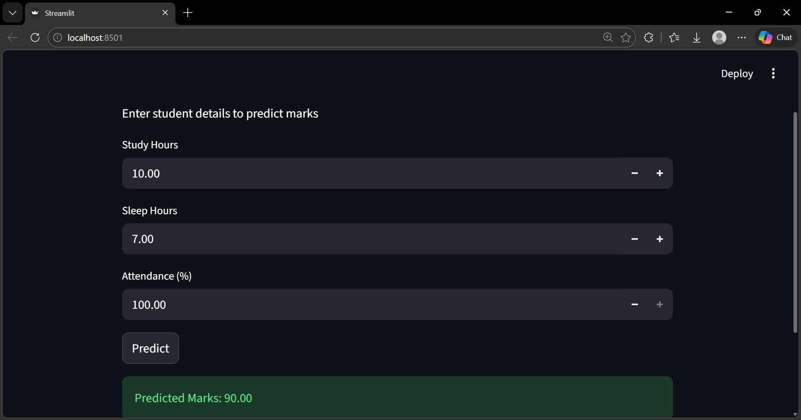
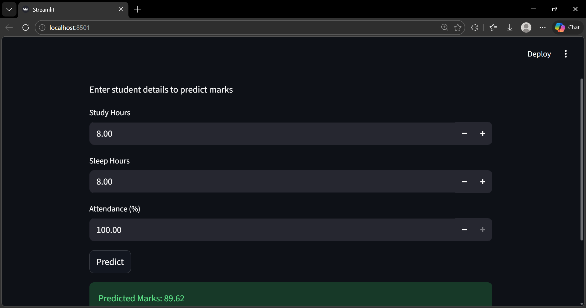

#  Student Performance Predictor

## Overview

This project is a machine learning-based web application that predicts student marks based on study hours, sleep hours, and attendance percentage.

It uses a Linear Regression model and a Streamlit interface to provide an easy-to-use prediction system.

---

##  Problem Statement

Students often want to estimate their academic performance based on their study habits and attendance. However, there is no simple way to predict expected marks.

---

## Solution

This project builds a predictive model using historical student data.
The user inputs:

* Study Hours
* Sleep Hours
* Attendance

The model then predicts the expected marks.

---

## Technologies Used

* Python
* Pandas
* Scikit-learn
* Streamlit

---

## How It Works

1. The dataset is loaded from a CSV file
2. Features (study hours, sleep, attendance) are selected
3. A Linear Regression model is trained
4. The user enters input values through a web interface
5. The model predicts the marks

---

## How to Run the Project

### 1. Install dependencies

```bash
pip install -r requirements.txt
```

### 2. Run the application

```bash
streamlit run app.py
```

---

## Sample Input

* Study Hours: 6
* Sleep Hours: 7
* Attendance: 80

### Output

Predicted Marks: ~70

---

## Screenshots






---

## Challenges Faced

* Understanding how machine learning models work
* Handling user input
* Converting the project into a web application

---

## Learning Outcomes

* Learned about supervised learning and linear regression
* Understood how to train and use ML models
* Built a real-world application using Streamlit

---

## Future Improvements

* Use a larger and more realistic dataset
* Add more features (like previous marks, assignments)
* Improve UI design

---

## Author

Mitali Pandey
